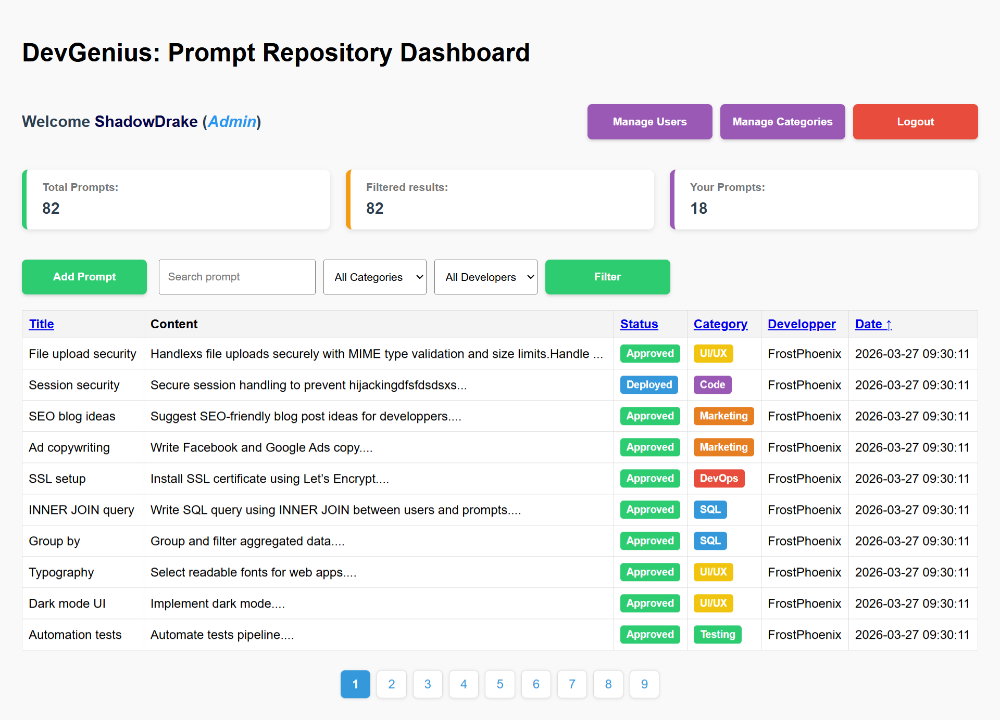
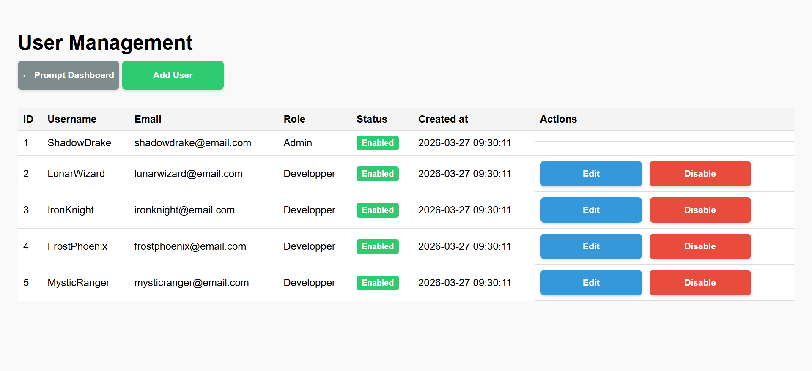
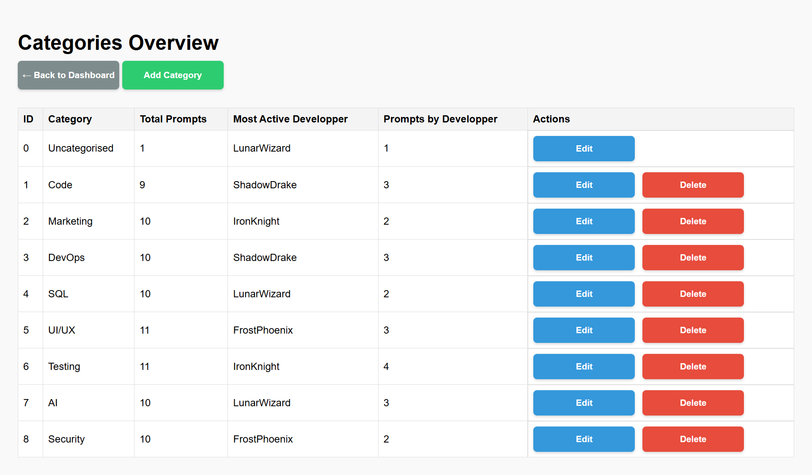

# DevGenius: Prompt Repository System

## Overview

DevGenius Prompt Repository System is a web-based platform to manage, categorize, and share programming and AI prompts. It provides a role-based system with **Admin** and **Developer** access levels. Admins can manage users, categories, and prompts, while developers can create and manage their own prompts.

---

## Features

- **User Management**
  - Admins can add, edit, and delete users.
  - Role-based access: Admin or Developer.
  
- **Category Management**
  - Admins can add, edit, and delete categories.
  - Assign prompts to categories.

- **Prompt Management**
  - Create, edit, and delete prompts.
  - Assign prompts to categories.
  - Status management: Approved, Rejected, Deployed.
  - Search, sort, and filter prompts.

- **Dashboard**
  - Overview of total prompts, filtered results, and user-specific prompts.
  - Quick links for admins to manage users and categories.

---

## Installation

Follow these steps to set up the project locally:

### Prerequisites

    *   Git: Make sure Git is installed. Download Git
    *   XAMPP: Install XAMPP to provide Apache, PHP, and MySQL.

### Steps

#### 1. Start XAMPP

*   Open the XAMPP Control Panel and start Apache and MySQL.

#### 2. Clone the repository inside htdocs

*   Open a VSCode terminal or Git Bash and navigate to XAMPP’s htdocs folder:
```bash
cd C:\xampp\htdocs
```
*   Clone your repository:
```bash
git clone https://github.com/BEN-ESSAHRAOUI-Yassine/DevGenius_Prompt_Repo.git
```
#### 3. Create and import the database
*   Open phpMyAdmin
*   Click Import, choose the **schema.sql** file inside the database folder of your repo, and execute the import
#### 4. Configure the project

*   Open the configuration file db.php and set your database credentials:
```bash
$host = "localhost";
$username = "root";
$password = "";
$dbname = "devgenius_db";
```
#### 5. Access the project

*   Open your browser and go to:
```bash
http://localhost/DevGenius_Prompt_Repo/
```
This ensures the .sql file inside your repo is used to set up the database correctly.

## Technologies Used

*    PHP (Core PHP with PDO for database access)
*    MySQL (Relational database with foreign keys & constraints)
*    HTML5 (Structure of all views and forms)
*    CSS3 (Custom styling + dynamic CSS generated via PHP)
*    XAMPP (Apache server & MySQL for local development)
*    Git (Version control)
*    PHP Sessions (Authentication & user state management)
*    Password Hashing (bcrypt via password_hash / password_verify)
*    Role-Based Access Control (Admin / Developer permissions system)

## Directory Structure

```
📁 DevGenius_Prompt_Repo
└── 📁admin                             # Admin management pages (users, categories)
    ├── add_category.php        
    ├── add_user.php
    ├── categories.php
    ├── delete_category.php
    ├── delete_user.php
    ├── edit_category.php
    ├── edit_user.php
    └── users.php
└── 📁Assets                            # CSS and dynamic style generation
    └── 📁css
        ├── style.css
        ├── style.php
└── 📁auth                              # Authentication & database connection
    ├── auth.php
    ├── db.php
    └── role.php
└── 📁Database                          # Database schema & initial data
    └── schema.sql
└── 📁devgest                           # Developer prompt management
    └── prompt_form.php
└── index.php                           # Dashboard & main page
└── login.php                           # Login logic
└── logout.php                          # Logout logic
└── register.php                        # create new account logic
└── README.md

```

## Security Measures
*   Password hashing with password_hash().
*   Role-based access control.
*   Prepared statements to prevent SQL injection.
*   Input validation and sanitization.
*   Session-based authentication.

## Notes
Admin role is required for user and category management.
Developers can only manage prompts they own.
Dynamic CSS classes are generated based on categories for consistent UI colors.

## Usage Scenarios

### 1. Developer Journey (Main Flow)

1. Register a new account via the registration page.
2. Log in using your credentials.
3. Access the dashboard.
4. Click **"Add Prompt"**.
5. Fill in:

   * Title
   * Content
   * Category
6. Submit the prompt.
7. The prompt appears in the dashboard list.
8. Use:

   * Search bar (by title/content)
   * Category filter
   * Developer filter
9. Click a prompt to:

   * View details
   * Copy prompt
   * Edit (if owner)
   * Delete (if owner)

---

### 2. Admin Workflow

1. Log in as Admin.
2. Access:

   * **Manage Users**
   * **Manage Categories**
3. Perform actions:

   * Create / Edit / Delete users
   * Enable / Disable users
   * Create / Edit / Delete categories
4. Monitor:

   * Number of prompts per category
   * Most active developer per category
5. Moderate prompts:

   * Change status (Approved / Rejected / Deployed)

---

### 3. Prompt Management Lifecycle

1. Developer creates a prompt → default status: **Approved**
2. Admin can:

   * Approve
   * Reject
   * Deploy
3. Once **Deployed**:

   * Developers cannot edit it anymore

---

### 4. Search & Filtering

Users can refine results using:

* Keyword search (title + content)
* Category filter
* Developer filter
* Sorting (title, date, status, etc.)
* Pagination for large datasets

## Advanced Features

* 🔎 Multi-criteria search (title + content + category + developer)
* 📊 Pagination system for large datasets
* 🔃 Dynamic sorting (ASC / DESC on multiple fields)
* 🎨 Dynamic category color system (generated via PHP)
* 📋 Copy-to-clipboard functionality for prompts
* 🔐 Role-based permissions system (Admin vs Developer)
* 🚦 Prompt status workflow (Approved / Rejected / Deployed)

## Database Design

The application uses a relational database with 3 main tables:

* **users**

  * Stores user credentials, roles, and status
* **categories**

  * Stores prompt categories
* **prompts**

  * Stores prompt content and metadata

### Relationships

* Each prompt belongs to:

  * One user (`user_id`)
  * One category (`category_id`)

* Foreign keys ensure:

  * Data integrity
  * Consistent relationships between tables

### Example

* A developer creates a prompt → linked to their user ID
* A category groups multiple prompts

## Test Accounts

You can use the following pre-seeded accounts to test the application:

| Role      | Username     | Password   | Status  |
| --------- | ------------ | ---------- | ------- |
| Admin     | ShadowDrake  | dragon123  | Enabled |
| Developer | LunarWizard  | moonmagic  | Enabled |
| Developer | IronKnight   | sword456   | Enabled |
| Developer | FrostPhoenix | icefire789 | Enabled |
| Developer | MysticRanger | forest999  | Enabled |
> ⚠️ These accounts are for development/testing purposes only.
### Notes

* The **Admin account** has full access:

  * Manage users
  * Manage categories
  * Moderate prompts
* **Developers** can:

  * Create prompts
  * Edit/delete their own prompts
* All passwords are hashed in the database using `password_hash()`.

## Additional Features & Enhancements

- **Advanced Multi-Criteria Search**  
  Allows users to search and filter prompts by title, content, category, and developer at the same time, providing a more powerful and flexible way to find relevant data.

- **Pagination System**  
  Implements LIMIT and OFFSET to efficiently handle large datasets, improving performance and user experience by splitting results into multiple pages.

- **Dynamic Sorting**  
  Enables sorting by different columns (title, status, category, developer, date) with ascending/descending toggle, making data exploration easier.

- **Role-Based Access Control (RBAC)**  
  Introduces Admin and Developer roles with specific permissions, ensuring secure and controlled access to features across the application.

- **User Status Management**  
  Allows administrators to enable or disable user accounts, adding an extra layer of control and moderation.

- **Dashboard Statistics**  
  Displays key insights such as total prompts, filtered results, and user contributions, helping users quickly understand system activity.

- **Category Analytics**  
  Provides advanced insights like total prompts per category and the most active developer in each category, enhancing data visibility.

- **Prompt Status Workflow**  
  Adds a moderation system with statuses (Approved, Rejected, Deployed), allowing better control over prompt lifecycle.

- **Copy-to-Clipboard Feature**  
  Enables users to quickly copy prompts with one click, improving usability and productivity.

- **Dynamic UI Styling**  
  Generates category-based styles dynamically using PHP, making the interface more scalable and visually organized.

- **Ownership & Permission Logic**  
  Ensures that developers can only edit their own prompts and restricts editing of deployed prompts, preserving data integrity.

- **Unified Prompt Management Interface**  
  Combines add, edit, view, and delete functionalities into a single dynamic form, improving maintainability and reducing code duplication.

## Screenshots

### Dashboard



### Users Panel for admin only



### Category Panel for admin only



