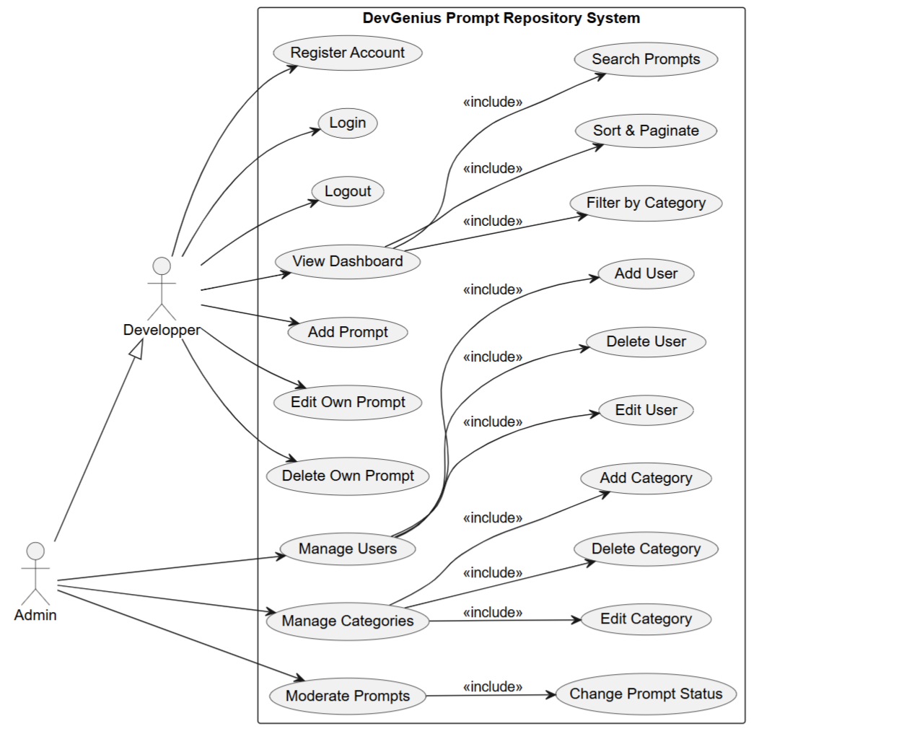
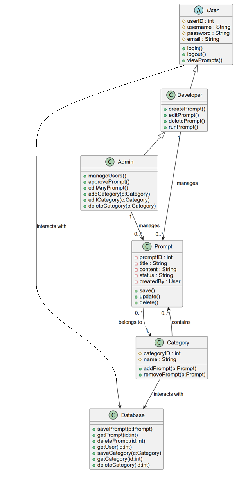
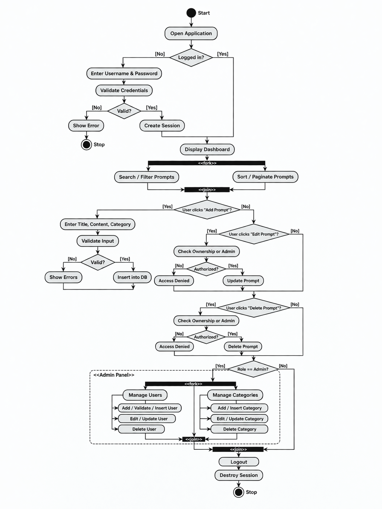

# DevGenius: Prompt Repository System

## Overview

DevGenius is a web-based platform to manage, categorize, and share programming and AI prompts. It provides a role-based system with **Admin** and **Developer** access levels. Admins can manage users, categories, and prompts, while developers can create and manage their own prompts.

---

## Features

- **User Management**
  - Admins can add, edit, and delete users.
  - Role-based access: Admin or Developer.
  
- **Category Management**
  - Admins can add, edit, and delete categories.
  - Assign prompts to categories.

- **Prompt Management**
  - Create, edit, and delete prompts.
  - Assign prompts to categories.
  - Status management: Approved, Rejected, Deployed.
  - Search, sort, and filter prompts.

- **Dashboard**
  - Overview of total prompts, filtered results, and user-specific prompts.
  - Quick links for admins to manage users and categories.

---

## Installation

Follow these steps to set up the project locally:

### Prerequisites

    *   Git: Make sure Git is installed. Download Git
    *   XAMPP: Install XAMPP to provide Apache, PHP, and MySQL.

### Steps

#### 1. Start XAMPP

    *   Open the XAMPP Control Panel and start Apache and MySQL.

#### 2. Clone the repository inside htdocs

    *   Open a VSCode terminal or Git Bash and navigate to XAMPP’s htdocs folder:
```bash
cd C:\xampp\htdocs
```
    *   Clone your repository:
```bash
git clone https://github.com/BEN-ESSAHRAOUI-Yassine/DevGenius_Prompt_Repo.git
```
#### 3. Create and import the database
    *   Open phpMyAdmin
    *   Click Import, choose the **schema.sql** file inside the database folder of your repo, and execute the import
#### 4. Configure the project

    *   Open the configuration file db.php and set your database credentials:

$host = "localhost";
$username = "root";
$password = "";
$dbname = "devgenius_db";

#### 5. Access the project

    *   Open your browser and go to:
```bash
http://localhost/DevGenius_Prompt_Repo/
```
This ensures the .sql file inside your repo is used to set up the database correctly.

## Technologies Used

    *    PHP (Core PHP with PDO for database access)
    *    MySQL (Relational database with foreign keys & constraints)
    *     HTML5 (Structure of all views and forms)
    *    CSS3 (Custom styling + dynamic CSS generated via PHP)
    *    XAMPP (Apache server & MySQL for local development)
    *    Git (Version control)
    *    PHP Sessions (Authentication & user state management)
    *    Password Hashing (bcrypt via password_hash / password_verify)
    *    Role-Based Access Control (Admin / Developer permissions system)

## Directory Structure

```
📁 DevGenius_Prompt_Repo
└── 📁admin                             # Admin management pages (users, categories)
    ├── add_category.php        
    ├── add_user.php
    ├── categories.php
    ├── delete_category.php
    ├── delete_user.php
    ├── edit_category.php
    ├── edit_user.php
    └── users.php
└── 📁Assets                            # CSS and dynamic style generation
    └── 📁css
        ├── style.css
        ├── style.php
    └── 📁imgs
        ├── Activity_Diagram.png
        ├── Diagram_Class.png
        └── Diagram_sequence.png
        └── Diagram_Use_Case.png
└── 📁auth                              # Authentication & database connection
    ├── auth.php
    ├── db.php
    └── role.php
└── 📁Database                          # Database schema & initial data
    └── schema.sql
└── 📁devgest                           # Developer prompt management
    ├── add_prompt.php
    ├── delete_prompt.php
    └── update_prompt.php
└── index.php                           # Dashboard & main page
└── login.php                           # Login logic
└── logout.php                          # Logout logic
└── newlogin.php                        # create new account logic
└── README.md

```

## UML Diagrams

### 1. Use Case Diagram


---------------------------------------------------------------------------------------------------------------

### 2. Class Diagram


---------------------------------------------------------------------------------------------------------------

### 3. Activity Diagram


---------------------------------------------------------------------------------------------------------------

### 4. Sequence Diagram


---------------------------------------------------------------------------------------------------------------

## Security Measures
*   Password hashing with password_hash().
*   Role-based access control.
*   Prepared statements to prevent SQL injection.
*   Input validation and sanitization.
*   Session-based authentication.

## Notes
Admin role is required for user and category management.
Developers can only manage prompts they own.
Dynamic CSS classes are generated based on categories for consistent UI colors.